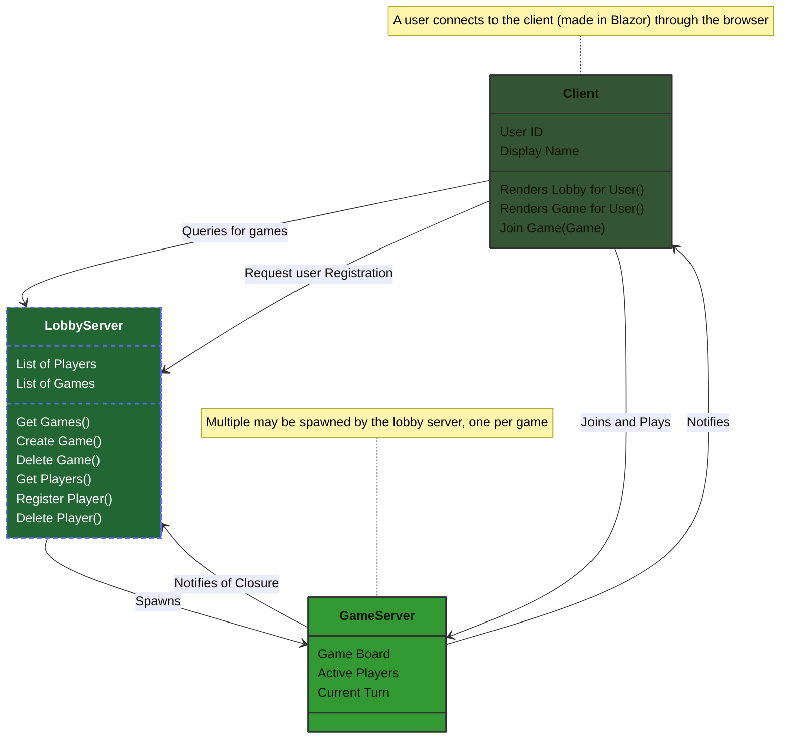

# Endless-Five
The repository for the hobby project of Infinite Five-in-a-row

## Conceptual Idea
Create a website to play five-in-a-row with multiple players (an arbitrary amount, perhaps 6?).
The playing field should be virtually endless, although restrictions exist on player moves.
Games should be possible to be saved between sessions, either on user accounts or as a link.

### Rules
Players take turns sequentially, and markers can only be placed adjacent to other already placed markers (diagonals included).
When one player gets five markers in a row (horizontally, vertically or diagonally), they win.

### Requirements
- Different player markers should be easily differentiable (shape and/or color).
- Should there be a time limit?
- Should there be an indicator for legal moves?
- Round tracker?
- Playing field needs to be scrollable.

### To Run
Open up a terminal, navigate to /server and execute ```dotnet run```. This will open the server in localhost:5093
In a different terminal, or your IDE of choice, navigate to /client and execute ```dotnet run```. This will open up the blazor app.


### Architecture (Draft)

